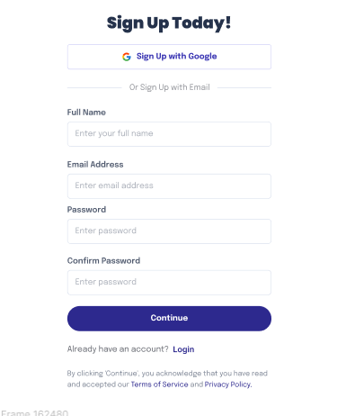
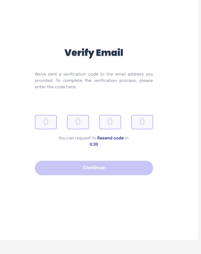

# Project Name

A brief description of what this project does and who it's for.

## Table of Contents

- [Installation](#installation)
- [Usage](#usage)
- [Contributing](#contributing)

## Installation

To install this project, follow these steps:

1. Clone the repository:
    ```sh
    git clone https://github.com/Aha-GY/NEXTAUTH-APP.git
    ```
2. Navigate to the project directory:
    ```
    cd NEXTAUTH-APP
    ```
3. Install the dependencies:
    ```
    npm install
    ```

## Usage

To use this project, follow these steps:

1. Start the development server:
    ```
    npm run dev
    ```
2. Open your web browser and go to [http://localhost:3000](http://localhost:3000)

## Contributing

To contribute to this project, follow these steps:

1. Fork this repository.
2. Create a branch: 
    ```
    git checkout -b <branch_name>
    ```
3. Make your changes and commit them:
    ```
    git commit -m '<commit_message>'
    ```
4. Push to the original branch:
    ```
    git push origin <project_name>/<location>
    ```
5. Create the pull request.

Alternatively, see the GitHub documentation on [creating a pull request](https://help.github.com/articles/creating-a-pull-request/).


## signup page 


## varify-email page


## login page


